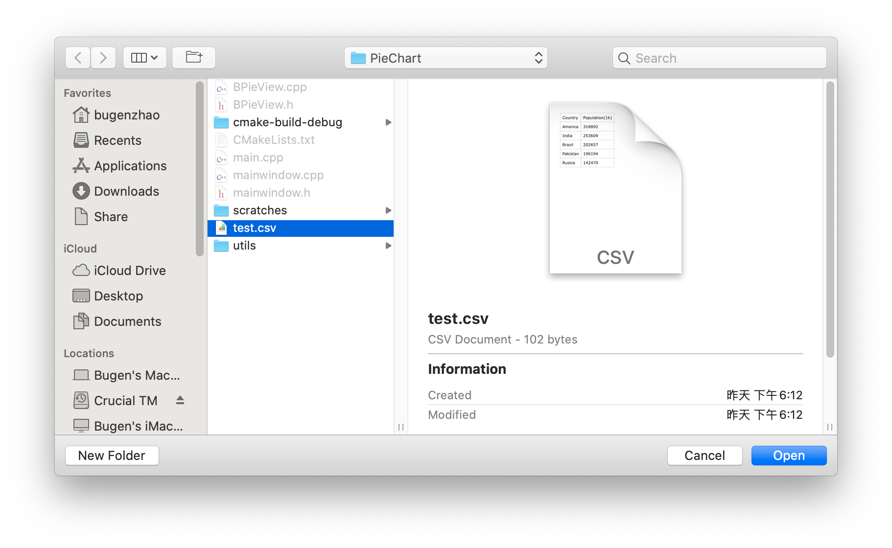
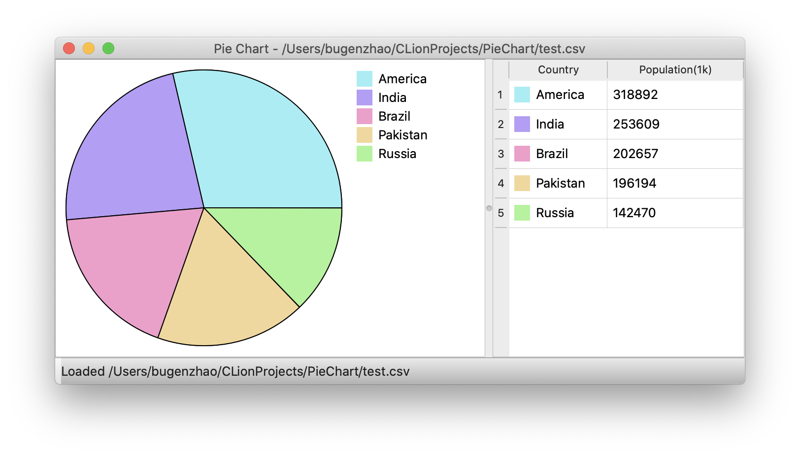

# Pie Chart

## Build

1. Update `CMAKE_PREFIX_PATH` in `CMakeLists.txt` according to your own Qt5 `cmake` path.
2. Run `cmake .` and then `make` in Terminal.app.

## Usage

1. Open a `.csv` file directly or via File => Open. 

   Please notice that the second column of the document must be number values.

2. Then you will get the pie chart immediately. 

## Reference

An MVC-based pie chart example from Qt official.

